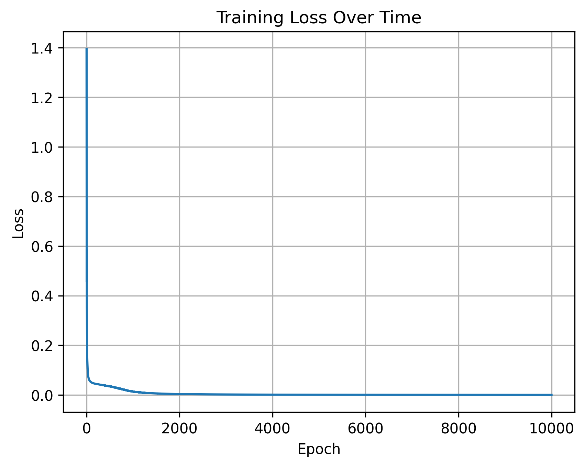

# Neural Network from Scratch

This project implements a fully connected neural network from scratch using Python and NumPy.  
All forward and backward propagation steps are computed manually using matrix and vector calculus.

The model is trained and evaluated on the Iris flower dataset.

---

## Motivation

The goal of this project was to gain a deeper understanding of how neural networks work internally by:

- Implementing backpropagation manually
- Applying the chain rule using matrix calculus
- Avoiding high-level machine learning frameworks

---

## Model Architecture

- Input layer: 4 features
- Hidden layer: 8 neurons with ReLU activation
- Output layer: 3 neurons with Softmax activation
- Loss function: Cross-Entropy
- Optimization: Gradient Descent
- Weight initialization: Xavier initialization

---

## Dataset

- Iris dataset (150 samples)
- 4 input features
- 3 output classes (one-hot encoded)

`scikit-learn` is used **only** for dataset loading, preprocessing, and train-test splitting.  
The neural network itself is implemented entirely from scratch.

---

## Training Results

The model converges reliably during training.

- Training epochs: 10,000
- Final training loss: < 0.0003

### Loss Curve

---

## Technologies Used

- Python
- NumPy
- Matplotlib
- scikit-learn (data handling only)

---

## What I Learned

- How backpropagation arises directly from the chain rule
- How matrix dimensions control gradient flow
- The importance of numerical stability in softmax and cross-entropy loss
